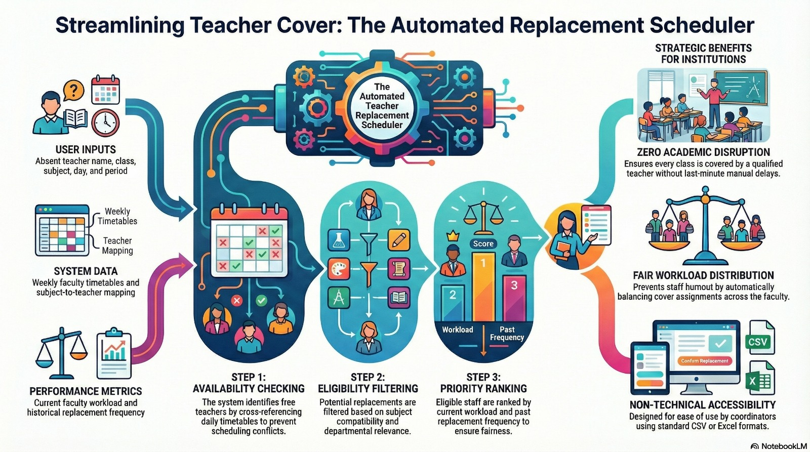
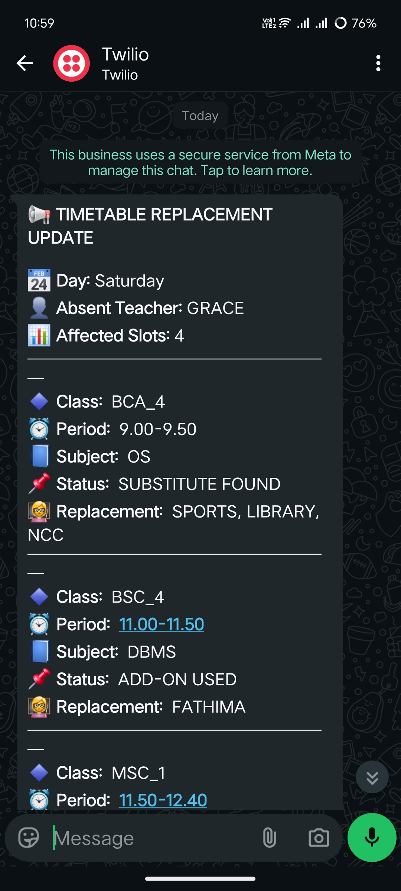
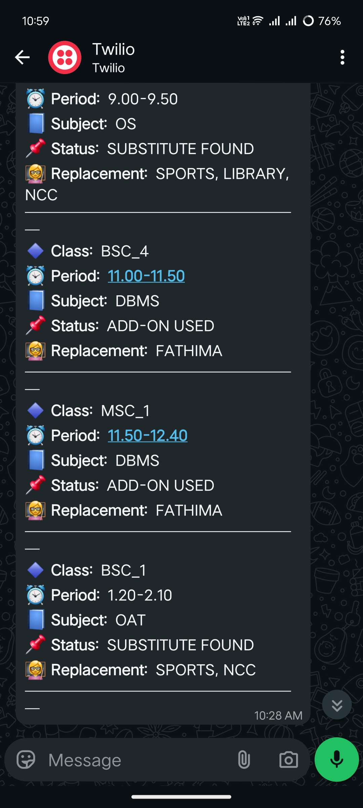
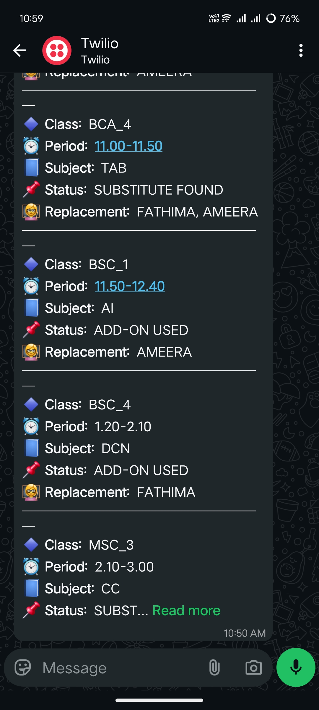

# 📊 Academic Timetable Automation System  

An operational analytics-driven system designed to evaluate real-time faculty availability, resolve substitution conflicts across parallel class slots, and structure fair replacement allocation through rule-based prioritization.

---

## 🔍 Problem Context  

Last-minute faculty absences often result in manual coordination, uneven workload distribution, and delayed communication across departments.

This system transforms substitute management from reactive messaging into a structured, analytics-informed workflow.

---

## 🧠 Analytical Framework (Core Engine)

The system evaluates multiple decision layers before assigning a replacement:

- Daily faculty timetable availability  
- Cross-class slot conflict detection  
- Subject-to-teacher eligibility mapping  
- Historical replacement frequency  
- Current workload balancing  

Replacement candidates are filtered and ranked to ensure:

- No overlapping teaching assignments  
- Subject compatibility validation  
- Fair workload distribution  
- Reduced repetitive allocation bias  

This converts manual coordination into a structured decision pipeline.

---

## ⚙️ Controlled Workflow Automation

To prevent notification misuse and broadcast spam:

- Substitution results are first previewed via web interface  
- WhatsApp notifications require manual confirmation  
- Twilio API integration ensures structured institutional formatting  
- Controlled trigger logic separates analytics from communication  

This maintains operational clarity while avoiding communication overload.

---

## 🏗 System Architecture  

**Frontend:** React + TypeScript  
**Backend:** Python API  
**Data Engine:** CSV-based faculty timetable mapping  
**Notification Layer:** Twilio WhatsApp API  
**Deployment:** Cloud-hosted frontend  

---

## 🖥 Web Interface Preview  

The dashboard enables administrators to:

- Input absent faculty details  
- Analyze available substitutes  
- Preview allocation results  
- Trigger WhatsApp notifications manually  

🎥 Demo Video:  
[Watch Workflow Demo](assets/Skedular_demo_tututorial.mp4)

---

## 📲 WhatsApp Output Samples  

Structured, mobile-friendly institutional notification format:

  
  
  

---

## 🔒 Data Governance & Privacy  

Core automation logic, institutional datasets, and API credentials remain private due to academic data sensitivity.

This repository showcases system design, workflow architecture, and structured output demonstration only.

---

## 🚀 What This Project Demonstrates  

- Operational analytics design thinking  
- Multi-layer decision filtering logic  
- Conflict-aware allocation systems  
- Responsible automation practices  
- Cloud deployment and API integration  
